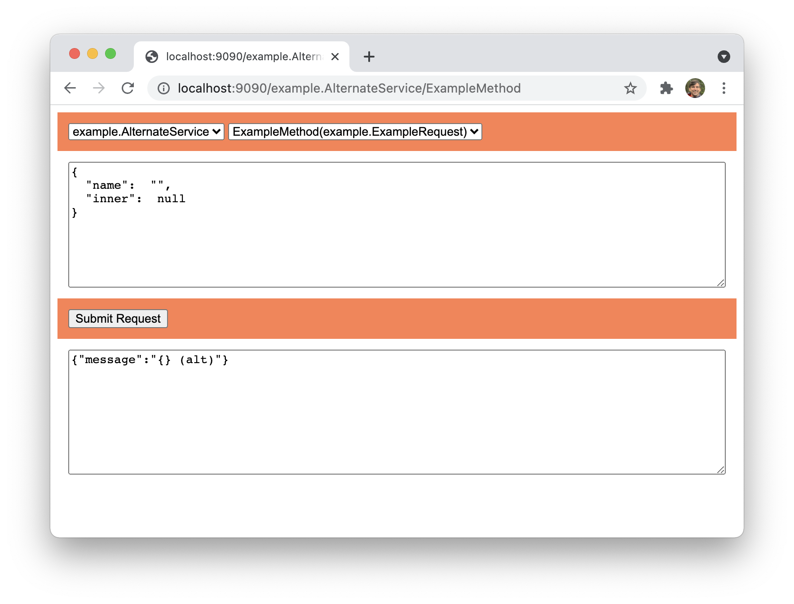

# GRPC Viewer

Allows you to play with your GRPC-Go service by sending [Canonical JSON](https://developers.google.com/protocol-buffers/docs/proto3#json)-formatted requests.

## Usage

Try it out by cloning the repo and running `make example`, then browsing to :9090.

To use in your own code, simply:

    import grpcviewer "github.com/fizx/grpc-viewer"
    grpcServer := grpcviewer.NewServer() // instead of grpc.NewServer()

